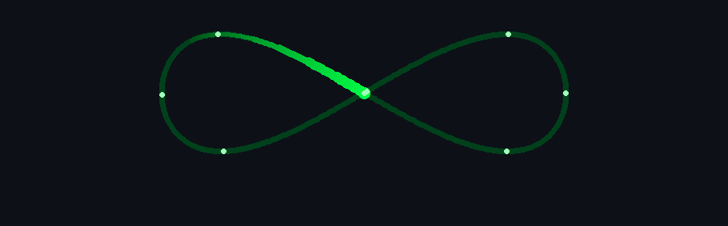

<div align="center">




<br/>

`[ ACCESS GRANTED ]` &nbsp; `PES UNIVERSITY // CSE` &nbsp; `[ STATUS: BUILDING ]`

<br/><br/>

<a href="https://shivaswaroopportfolio.netlify.app/"></a>
<a href="https://linkedin.com/in/swaroop-d-s-1b0253331"></a>
<a href="https://github.com/InfiniBuilds"></a>

</div>

<br/>

```console
┌──(swaroop㉿InfiniBuilds)-[~]
└─$ ./whoami --verbose

[+] IDENTITY      : SWAROOP D S
[+] ROLE          : FULL-STACK ENGINEER // SECURITY RESEARCHER
[+] CURRENT OPS   : POST-QUANTUM CRYPTOGRAPHY
[+] SIDE QUEST    : DESIGN // VIDEO EDITING
[+] SYSTEM STATE  : LEARNING. BUILDING. ITERATING.

┌──(swaroop㉿InfiniBuilds)-[~]
└─$ █
```

## `> cat /proc/current_mission`

<table>
<tr>
<td width="55%">

```text
MISSION_ID : Q-ORCHESTRATOR
STATE      : ACTIVE RESEARCH

TARGET:
Real-time quantum-resistant
communication for Banking + IoT.

CRYPTO STACK:
├─ ML-KEM / Kyber
├─ ML-DSA / Dilithium
├─ AES-256
└─ Hybrid cryptographic profiles

OPERATIONS:
├─ Quantum-safe key exchange
├─ Authentication & signatures
├─ Encrypted communication
└─ Performance benchmarking
```

</td>
<td width="45%" align="center">

### `THREAT_MODEL.exe`

```text
      CLASSICAL SYSTEM
             │
             ▼
   HARVEST NOW ───────┐
                      │
              QUANTUM ERA
                      │
                      ▼
               DECRYPT LATER
                      │
                      ▼
              [ DATA EXPOSED ]

              ── VS ──

     PQC + AES-256 HYBRID
              │
              ▼
       [ QUANTUM-RESILIENT ]
```

</td>
</tr>
</table>

> **Research question:** `How do we make post-quantum security practical enough for real-time systems?`

---

## `> ls ~/projects --classified`

<table>
<tr>
<td width="50%" valign="top">

### `0x01 // Q-ORCHESTRATOR` 🔐

**Quantum-Resistant Secure Communication Framework**

`Python` `Qiskit` `ML-KEM` `ML-DSA` `AES-256`

Building a hybrid PQC framework for banking and IoT communication. Benchmarking key generation, encryption/decryption, signatures and latency against classical cryptography.

`STATUS: ███████░░░ RESEARCHING`

</td>
<td width="50%" valign="top">

### `0x02 // VIRTUAL_WARDROBE.AI` 🧠

**AI-Powered Personal Stylist**

`React` `Node.js` `Express` `MongoDB` `Gemini`

Context-aware outfit recommendations using real-time weather and calendar data, with wear-count and laundry-state tracking.

`STATUS: ██████████ ONLINE`

</td>
</tr>

<tr>
<td width="50%" valign="top">

### `0x03 // PRESCRIPTIFY.C` ⚕️

**Digital Prescription Management**

`C` `HTML` `CSS` `File I/O`

Role-based prescription system for doctors and patients with prescription history and modular record management using structs, arrays and file handling.

`STATUS: ██████████ ONLINE`

</td>
<td width="50%" valign="top">

### `0x04 // NEURAL_HIVE.WEB` 🕸️

**Content-First Blog Platform**

`Astro` `HTML` `CSS` `JavaScript`

A lightweight publishing platform designed to reduce friction for non-technical writers and keep the content workflow maintainable.

`STATUS: ██████████ DEPLOYED`

</td>
</tr>
</table>

---

## `> ./load_arsenal.sh`

<div align="center">


<br/><br/>

```text
[ CRYPTOGRAPHY ]  Post-Quantum Cryptography // Qiskit // Hybrid Security
[ ENGINEERING  ]  Full-Stack Systems // APIs // Data Structures
[ CREATIVE     ]  Design // Video Editing
```

</div>

---

## `> cat responsibility.log`

```diff
+ [ KANNADA KOOTA ]  TECHNICAL & DESIGN HEAD
+ [ NEURAL HIVE  ]  WEB DEVELOPMENT MEMBER

! engineering systems
! designing interfaces
! researching what happens when today's cryptography meets tomorrow's computers
```

---

## `> ./telemetry --live`

<div align="center">


<br/>


<br/>


</div>

---

## `> cat future_targets.enc`

```text
[01] DEEPEN POST-QUANTUM CRYPTOGRAPHY RESEARCH
[02] BUILD PRACTICAL QUANTUM-SAFE SYSTEMS
[03] EXPLORE AI × CYBERSECURITY THREAT DETECTION
[04] STRENGTHEN CORE SECURITY FUNDAMENTALS
[05] SHIP SYSTEMS THAT SURVIVE OUTSIDE LOCALHOST
```

<div align="center">

<br/>

```text
╔══════════════════════════════════════════════════════════╗
║                                                          ║
║    THERE IS NO FINAL BUILD.                              ║
║    THERE IS ALWAYS ANOTHER ITERATION.                ∞   ║
║                                                          ║
╚══════════════════════════════════════════════════════════╝
```


<br/><br/>

`swaroop@InfiniBuilds:~$ echo "Ready to build."`

### `Ready to build. █`

</div>
